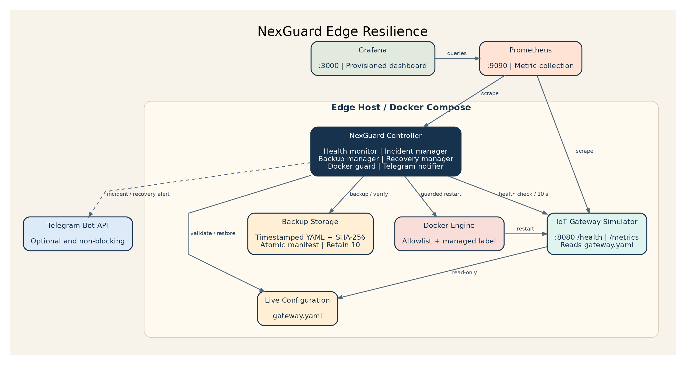
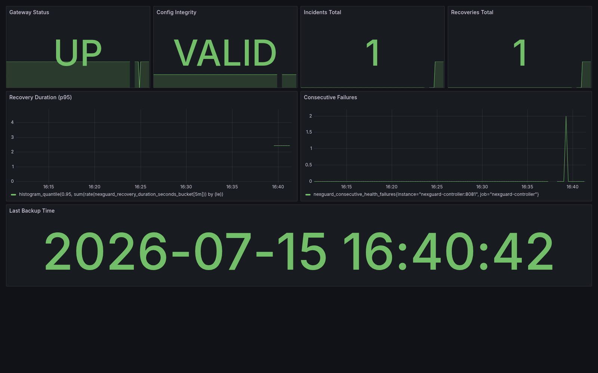
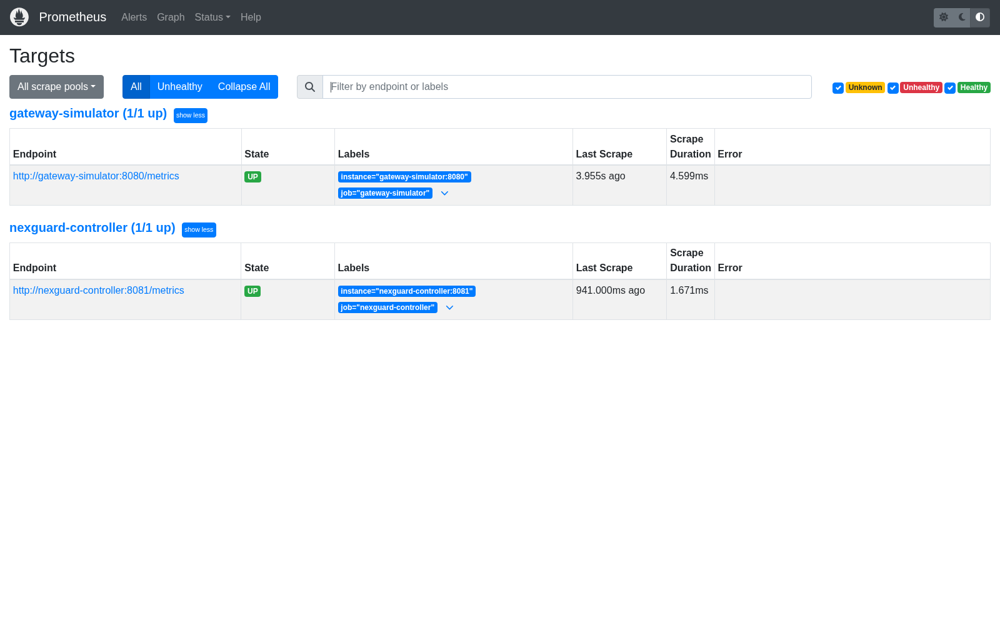

# NexGuard Sentinel ? ETHOnline 2026

> **Autonomous Circuit Breaker with Verifiable AI, The Graph Observability, and Ledger Clear Signing.**  
> Developed for **ETHOnline 2026** (Security / Continuity Track). Extends the pre-event resilient supervisor architecture with an end-to-end onchain protection pipeline.

[](sentinel/tests/)
[](pyproject.toml)
[](pyproject.toml)
[](LICENSE)

---

## 3 Load-Bearing Partner Tracks

| Partner | Track | Role in Sentinel Lifecycle | Verified Artifacts |
|---|---|---|---|
| **The Graph** | Best AI Tooling / AI Use Case (Continuity) | Live event ingestion and feature extraction from Base Sepolia | Subgraph Studio v0.1.0, sub-3s query latency, deterministic cursor |
| **Bazantic** | Help an Agent Use Your Hackathon Project (Continuity) | Post-incident AI investigation, Recipe, and x402 Incident Evidence API | MCP server, Recipe JSON, SHA-256 fingerprint, A/B Benchmark (+3 score) |
| **Ledger** | Continuity | Clear Signing and hardware confirmation gate for human protocol unpause | ERC-7730 descriptor, simulated hardware screen, wallet-cli keyring |

---

## Sentinel Architecture & Closed Loop

```text
WATCH (The Graph) --> DETECT (Features + AI) --> DECIDE (ActionPolicy) --> ACT (Guardian.pause) --> PROVE (Evidence API / Bazantic) --> RECOVER (Ledger)
```

1. **Watch**: The Graph Subgraph indexes `Withdrawal` events from `DemoVault` on Base Sepolia.
2. **Detect**: `sentinel.classifier` extracts velocity (bps), volume, and actors; evaluates threat with fail-closed AI classification.
3. **Decide**: `sentinel.policy.ActionPolicy` checks safety latch, enforces pause-only allowlist, checks cooldown, and reserves action atomically.
4. **Act**: `sentinel.actuator` signs and broadcasts `Guardian.pause()`, persists tx hash, and confirms onchain state.
5. **Prove**: `sentinel.evidence_api` publishes structured cryptographic proof behind x402 payment gate; Bazantic agent investigates via MCP.
6. **Recover**: Protocol owner reviews incident details on Ledger screen (ERC-7730 Clear Signing) and calls `Guardian.unpause()`.

---

## Verified Live Base Sepolia Evidence

| Phase | Action | Basescan Link | Block | Verified Outcome |
|---|---|---|---|---|
| **Incident Trigger** | Vault Exploited Withdrawal | [`0x05e2c2fa...`](https://sepolia.basescan.org/tx/0x05e2c2fad8422867dc97587bb9f4fd8516f616ed41ecd30469738a221d1ae35e) | 46433924 | 25 ETH anomaly event |
| **Observability** | The Graph Studio Query | [Studio Endpoint](https://api.studio.thegraph.com/query/1758726/nexguard-sentinel/v0.1.0) | 46433925 | Entity indexed (<3s) |
| **Autonomous Pause** | Guardian.pause() | [`0xaa915ea5...`](https://sepolia.basescan.org/tx/0xaa915ea5e86823ec63259d3573b05c4e243fbbaae3ae3a8003dbaf8582e29d75) | 46433927 | Guardian paused onchain |
| **Circuit Breaker** | Blocked Withdrawal | Reverted with `GuardianPaused()` (`0xdfe79c85`) | - | Vault protected |
| **AI Investigation** | Bazantic Evidence API | Incident `inc_6a2d...` / SHA-256 `6758056f...` | - | Agent verified via MCP |
| **Owner Recovery** | Guardian.unpause() | [`0x2f68bdd8...`](https://sepolia.basescan.org/tx/0x2f68bdd881089057139f38d1ce7585169d27ff793f5b7af5a34951def628b070) | 46434002 | Protocol restored to active |

- **Guardian Contract (Base Sepolia)**: [`0x8B7B1Ee7e335FD00F35cc6272C113c8735cB8Ed3`](https://sepolia.basescan.org/address/0x8B7B1Ee7e335FD00F35cc6272C113c8735cB8Ed3)
- **DemoVault Contract (Base Sepolia)**: [`0xF1683d32fEF59BBB95483561aBa62a1bdA65Cd13`](https://sepolia.basescan.org/address/0xF1683d32fEF59BBB95483561aBa62a1bdA65Cd13)

---

## Quickstart for Judges

Reproduce all tests in one command (no blockchain keys required):

```bash
git clone --branch feature/ethonline-sentinel https://github.com/Seranov67/nexguard-sentinel.git
cd nexguard-sentinel
python -m pip install -e ".[dev]"

# Run full test suite (102 tests: Sentinel core, Classifier, Policy, Loop, Bazantic, Ledger, Contracts)
pytest sentinel/tests/ contracts/tests/

# Verify code quality
ruff check sentinel/
mypy sentinel/
```

### Operational CLI Commands

```bash
# Check system status, cursor, and onchain Guardian state
python -m sentinel.cli status

# Run single autonomous loop pass (with simulation)
python -m sentinel.cli run --once --dry-run

# Run Ledger ERC-7730 Clear Signing recovery simulation
python -m sentinel.ledger.unpause_ledger --simulate --reason "Security audit passed: vulnerability patched"

# Run Bazantic A/B Benchmark comparison
python -m sentinel.bazantic.benchmark_ab
```

---

## Event Documentation & Lineage

- Branch: `feature/ethonline-sentinel`
- Baseline: `pre-ethonline-2026` tag at `fa202e994a77ea365061f6ac609daea1b5ad60dd`
- [Prior Work & Disclosure](docs/ethonline/DISCLOSURE.md)
- [Compliance Matrix](docs/ethonline/COMPLIANCE.md)
- [AI Assistance Log](docs/ethonline/AI_USAGE.md)
- [Prompt Register](docs/ethonline/AI_PROMPTS.md)
- [Partner Strategy](docs/ethonline/PRIZES.md)
- [A/B Benchmark Results](docs/ethonline/BAZANTIC_AB_BENCHMARK.md)

---

## Pre-existing NexGuard Edge Resilience

The sections below describe the pre-event IoT MVP. Their completion claims and
DoraHacks placeholders refer to that older project, not the Sentinel submission.

[](https://github.com/Seranov67/nexguard-sentinel/actions/workflows/ci.yml)
[](https://www.python.org/)
[](LICENSE)

Automated monitoring, configuration backup, and self-recovery for remote IoT gateways
and smart-city infrastructure.

[Architecture](docs/architecture.png) | [Demo Video](#demo-video) | [Demo Runbook](docs/demo-scenario.md) |
[Video Script](docs/video-script.md) | [Security Model](docs/security.md)

> Hackathon MVP status: implementation and automated recovery are complete. Add the
> [DoraHacks submission URL](#dorahacks-submission) after the BUIDL is published.

## Demo Video

**Watch the 2–3 minute walkthrough:** *URL pending — publish to YouTube, Loom, or Vimeo
(unlisted or public) using [docs/video-script.md](docs/video-script.md), then replace this
line with the link.*

Recording checklist: 1080p, no secrets on screen (`.env`, tokens, passwords), opens in an
incognito window without sign-in.

## Problem

Remote IoT gateways support environmental monitoring, traffic management, utilities,
and other smart-city services. When a container stops or its configuration becomes
corrupted, limited access to on-site technicians can turn a small fault into prolonged
downtime and expensive manual recovery.

## Solution

NexGuard runs beside an IoT gateway and checks its health every 10 seconds. It validates
the gateway configuration, creates SHA-256-protected last-known-good backups, opens an
incident after three consecutive failures, restores a valid configuration when needed,
restarts only an explicitly managed container, and verifies that service is healthy again.

## Key Features

- Dockerized IoT gateway simulator with `/health` and `/metrics` endpoints
- Automatic failure detection after exactly three consecutive failed checks
- Atomic configuration backup and restore using `os.replace`
- SHA-256 verification, atomic manifest, and configurable retention of 10 backups
- Label and allowlist guards for every Docker restart
- Recovery cooldown and sliding-window rate limit
- Seven Prometheus metrics and an auto-provisioned Grafana dashboard
- Structured JSON incident and recovery logs
- Optional, non-blocking Telegram incident and recovery notifications
- Automated unit, type, lint, Compose, and end-to-end CI checks

## Architecture



The controller polls the gateway, manages verified backups, and performs guarded Docker
restarts. Prometheus scrapes both application services, Grafana visualizes the controller
metrics, and Telegram notifications run out-of-band so messaging failures cannot block
recovery. See [the detailed architecture notes](docs/architecture.md).

## Technology Stack

| Layer | Technology |
|---|---|
| Runtime | Python 3.12, FastAPI, uvicorn |
| Containers | Docker, Docker Compose V2 |
| Configuration | YAML, Pydantic |
| Integrity | SHA-256, atomic filesystem replacement |
| Recovery | Docker SDK for Python |
| Monitoring | Prometheus, Grafana |
| Notifications | Telegram Bot API via async HTTP |
| Quality | Pytest, Ruff, strict MyPy, GitHub Actions |

## Demo Scenario

The demo starts with a healthy gateway and a verified backup. A presenter then stops the
gateway container or corrupts its YAML configuration. NexGuard records three failed health
checks, opens an incident, selects the safe recovery path, restarts the gateway, performs a
post-recovery health check, and updates metrics and logs.

The complete presenter flow is in [docs/demo-scenario.md](docs/demo-scenario.md), and the
2–3 minute recording outline is in [docs/video-script.md](docs/video-script.md).

## Quick Start

Prerequisites: Docker with Compose V2. Python 3.12 is needed only for local test commands.

```bash
git clone https://github.com/Seranov67/nexguard-sentinel.git
cd nexguard-sentinel
cp .env.example .env
```

Set a local `GF_SECURITY_ADMIN_PASSWORD` in `.env`. Telegram values may remain empty.
On Linux, expose the host group IDs needed by the non-root controller:

```bash
export DOCKER_GID="$(stat -c '%g' /var/run/docker.sock)"
export NEXGUARD_DATA_GID="$(stat -c '%g' data/gateway)"
chmod g+w data/backups data/gateway
```

Start and verify the complete stack:

```bash
docker compose up -d --build --wait
docker compose ps
curl http://localhost:8080/health
curl http://localhost:8081/health
```

Open Grafana at [http://localhost:3000](http://localhost:3000) and Prometheus at
[http://localhost:9090](http://localhost:9090). Set `GRAFANA_PORT` when port 3000 is in use.
All published ports bind to `127.0.0.1` only.

## Failure Simulation

Scenario A stops the gateway and demonstrates restart-only recovery:

```bash
./scripts/demo-stop.sh
sleep 45
./scripts/verify-demo.sh
```

Scenario B corrupts the live config and demonstrates verified restore plus restart:

```bash
./scripts/reset-demo.sh
./scripts/demo-corrupt-config.sh
sleep 45
./scripts/verify-demo.sh
```

Return to a clean state at any time with `./scripts/reset-demo.sh`.

## Monitoring

Prometheus scrapes the gateway and controller. The provisioned Grafana dashboard shows
gateway status, configuration integrity, incident and recovery counts, p95 recovery
duration, consecutive failures, and last backup time.





The exported dashboard is committed at
[monitoring/grafana/dashboards/nexguard.json](monitoring/grafana/dashboards/nexguard.json).

## Telegram Notifications

Telegram is optional and disabled when either value is empty. To enable it, set these only
in the ignored `.env` file:

```dotenv
TELEGRAM_BOT_TOKEN=your_bot_token
TELEGRAM_CHAT_ID=your_chat_id
```

The controller schedules notifications without awaiting Telegram. Network or API failures
are logged as `notification_failed` and never interrupt recovery. No real token or chat ID
belongs in this repository.

## Security Considerations

The MVP mounts `/var/run/docker.sock`, which grants root-equivalent host privileges. Every
restart is restricted by both `NEXGUARD_ALLOWED_CONTAINERS` and the
`io.nexguard.managed=true` label, but production deployments should replace direct socket
access with a Docker Socket Proxy or a narrow host-agent API. Read
[docs/security.md](docs/security.md) before deployment.

## Project Impact

NexGuard reduces gateway downtime, limits the need for on-site intervention, and makes
failure handling observable and repeatable. The MVP demonstrates a practical resilience
pattern for distributed infrastructure where connectivity, power, and technician access
cannot be assumed.

## Future Development

- Replace direct Docker socket access with a least-privilege host agent
- Add signed backup metadata and configurable off-device backup replication
- Integrate a log backend for dashboard-visible incident history
- Add support for multiple gateways through isolated controller instances
- Package deployment profiles for additional edge Linux distributions

These are post-MVP directions; Kubernetes, cloud infrastructure, databases, authentication,
and AI/ML remain outside this repository's current scope.

## DoraHacks Submission

**BUIDL URL:** *pending — add the public DoraHacks project link after submission.*

## Team

Maintained by [Seranov67](https://github.com/Seranov67). The final DoraHacks team roster
should be added here before submission.

## Running Tests

```bash
python -m pip install -e ".[dev]"
ruff check .
mypy services/gateway-simulator
mypy services/nexguard-controller
pytest
docker compose config --quiet
```

## License

Licensed under the [MIT License](LICENSE).
