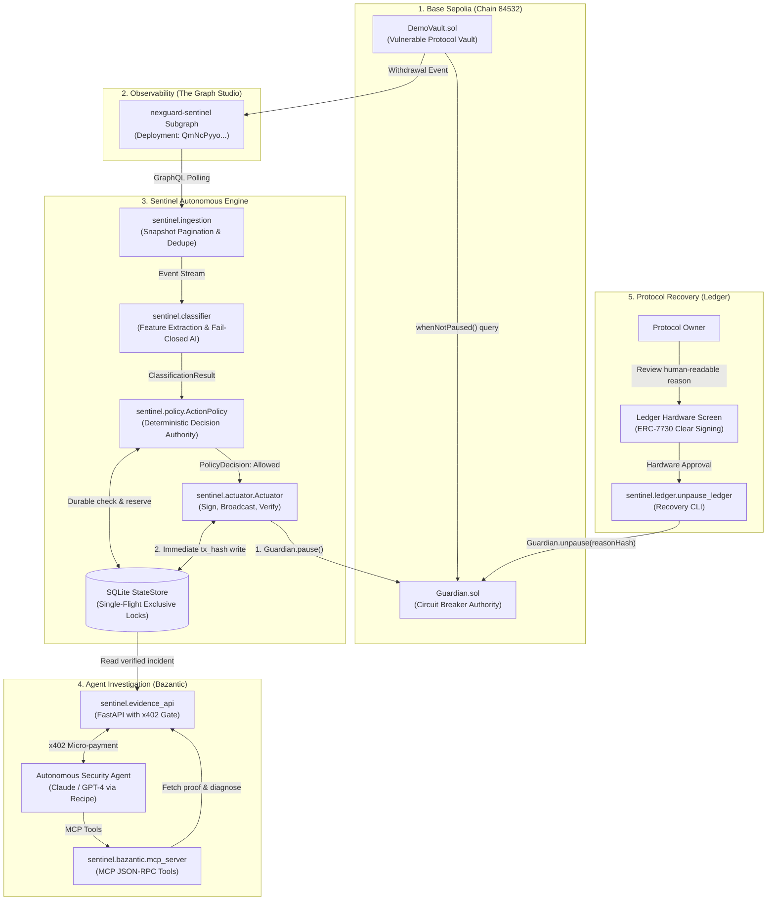

# NexGuard Sentinel ? System Architecture & Specification

## 1. Executive Summary

**NexGuard Sentinel** is a resilient, fail-closed autonomous incident response engine and circuit-breaker for onchain smart contracts. Built for **ETHOnline 2026**, Sentinel solves the critical latency window between an exploit starting onchain and human intervention.

Sentinel integrates three load-bearing ecosystems:
1. **The Graph**: Sub-3-second real-time indexing of onchain protocol events on Base Sepolia.
2. **Bazantic**: Post-incident autonomous agentic investigation via Model Context Protocol (MCP) and an x402-gated Incident Evidence API.
3. **Ledger**: Cryptographically enforced human-in-the-loop recovery with ERC-7730 Clear Signing metadata and hardware-isolated key management (`wallet-cli ring`).

---

## 2. System Architecture Diagram



---

## 3. Component Deep Dive

### 3.1 Smart Contract Layer (`contracts/src/`)
- **`Guardian.sol`**:
  - Implements asymmetric privilege separation: **Keepers can only pause; only the human Owner can unpause**.
  - Enforces replay protection: `usedIncidentRefs[incidentRef]` prevents an incident identifier from being reused.
  - Custom errors (`AlreadyPaused`, `UnauthorizedKeeper`, `UnauthorizedOwner`, `InvalidReference`) for minimal gas consumption.
- **`DemoVault.sol`**:
  - A valueless testnet vault exhibiting an intentional re-entrancy / unsafe withdrawal vulnerability (`unsafeWithdrawFrom`).
  - Guards withdrawals with `whenNotPaused` checking `guardian.paused()`.
  - Emits `Withdrawal(address,address,address,uint256,uint256)` indexed by The Graph.

### 3.2 Durable Storage & Concurrency Engine (`sentinel/store.py`)
- Single SQLite database with WAL mode (`PRAGMA journal_mode=WAL;`).
- **Single-Flight Invariant**:
  ```sql
  SELECT 1 FROM intents WHERE status IN ('reserved','prepared','broadcast','indeterminate')
  ```
  Only one action can be active in flight across all threads, processes, and restarts.
- **Durable State Machine**:
  `reserved` $\rightarrow$ `prepared` (nonce persisted) $\rightarrow$ `broadcast` (tx_hash persisted) $\rightarrow$ `success` / `reverted` / `already_desired` / `indeterminate`.
- **Safety Latch**:
  Any timeout, unexpected RPC disconnect, or post-state verification failure trips the safety latch. Once latched, all automated actions cease until an operator investigates and resets with an audit trail (`reset_latch(operator, reason)`).

### 3.3 AI Classification & Fail-Closed Logic (`sentinel/classifier.py`)
- **Deterministic Feature Extraction**:
  Extracts sliding-window metrics: count of events, velocity in basis points (bps), total volume in Wei, unique actors, and address concentration.
- **Fail-Closed Guarantees**:
  - Schema validation: Outputs must strictly adhere to the `IncidentClassification` schema (`severity`, `recommended_action`, `confidence`, `rationale`).
  - Confidence floor: Any output with `confidence < 0.8` is rejected.
  - Length bounding: `rationale` is capped at 240 characters to prevent prompt injection payload leakage.
  - Fallback: On LLM timeouts, malformed JSON, or unexpected tokens, the classifier falls back to safe inert defaults (`severity="info", action="none"`).
- **Catastrophic Threshold Backstop**:
  If total withdrawal volume breaches 10 ETH within the window, a deterministic override bypasses AI inference and forces `critical / pause`.

### 3.4 Deterministic Action Policy (`sentinel/policy.py`)
- Sole authority for action permission. The AI recommends; `ActionPolicy` decides.
- Pre-reads onchain state (`is_paused_onchain()`) to prevent redundant gas spend.
- Enforces an allowlist: only `pause` is valid (keepers are forbidden from executing `unpause`).
- Enforces a 300-second cooldown window between emergency actions to prevent transaction flooding.

### 3.5 Onchain Actuator (`sentinel/actuator.py`)
- Pre-computes calldata: `Guardian.pause(bytes32,uint8)` (`0xeb63b014`).
- Calculates dynamic gas price via `eth_gasPrice` and fetches pending nonce.
- Signs locally with Keeper private key and broadcasts transaction.
- Writes `tx_hash` to `store.broadcast()` **before** awaiting receipt.
- Awaits confirmation depth and executes a post-action onchain read of `Guardian.paused()` (`0x5c975abb`).

---

## 4. Formal Security Invariants (Audit Matrix)

| ID | Invariant Statement | Enforcement Mechanism |
|---|---|---|
| **INV-01** | Keepers can only reduce protocol availability (pause). | `Guardian.sol` restricts `unpause()` with `onlyOwner`. |
| **INV-02** | No action without atomic durable reservation. | `StateStore.reserve()` enforces exclusion inside SQLite transactions. |
| **INV-03** | AI failure cannot trigger unwarranted pauses. | `sentinel.classifier` is fail-closed; fallback is always non-action. |
| **INV-04** | Broadcaster crash cannot cause double-spend or nonce conflict. | Nonce and tx_hash are persisted in `store.prepare()` and `store.broadcast()` before network release. |
| **INV-05** | Ambiguous transaction status stops automation safely. | Timeout transitions intent to `indeterminate` and engages the safety latch. |
| **INV-06** | Protocol unpause requires human hardware verification. | Ledger Clear Signing ERC-7730 displays contract, function, and audit hash on device screen. |

---

## 5. Technology Stack

- **Smart Contracts**: Solidity 0.8.24, Foundry 1.5.1
- **Blockchain**: Base Sepolia (EVM, Chain ID 84532)
- **Observability**: The Graph Studio (GraphQL, Subgraph CLI 0.98.1)
- **Automation Runtime**: Python 3.11 / 3.12, Web3.py 8.0, Pydantic 2.10, FastAPI, Uvicorn
- **Durable Storage**: SQLite3 (WAL mode, schema version 1)
- **Agent Integration**: Model Context Protocol (MCP), x402 / MPP Payment Gateway
- **Hardware Integration**: ERC-7730 Clear Signing, Ledger Agent Stack (`wallet-cli ring`)
- **Quality Gates**: Pytest, Ruff 0.4+, MyPy 1.10+ (strict mode)
