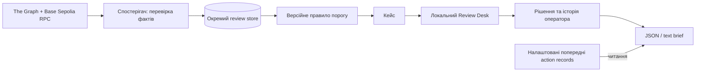

# NexGuard Sentinel — план v0.4 і каркас проєкту

**Дата:** 1 жовтня 2026. **Статус:** погоджений MVP реалізовано локально;
перша операторська сесія розпочата, підготовка до подання триває.
Цей документ оновлює v0.3 за фактичними результатами.

## 1. Продукт і перевірювана користь

NexGuard Sentinel допомагає оператору перевірити подію виведення, побачити
причину спрацювання правила й залишити рішення разом із доказами.
Перший сценарій — одна DemoVault у Base Sepolia, один оператор і одне правило.
Суми є безвартісними обліковими одиницями тестового контракту.

Гіпотеза користі: оператор витрачає менше зусиль на збирання фактів і передачу
кейсу колезі. Часова економія, попит і готовність платити ще не виміряні.
Перший користувач — власник проєкту; незалежна перевірка потрібна окремо.

## 2. Що вже виконано

| Частина | Фактичний результат |
|---|---|
| Погодження | SPEC-003 і вузький виняток для локального UI затверджені відповіддю «так далі» |
| Походження | Baseline 7a2a509 від 13.09; оригінальний checkout збережено; нова гілка feat/colosseum-review |
| Спостереження | Graph + RPC, перевірка receipt/log/блоку, стан джерела, окрема SQLite; без ключа й моделі |
| Правило | Точний цілий поріг, версія політики, стабільний ID кейсу, перевірка повторної обробки |
| Докази | Сирі факти, реальні explorer-посилання, явні прогалини; legacy evidence читається лише за окремим налаштуванням |
| Оператор | Три екрани, acknowledge/resolve, нотатки, ревізії, JSON/text brief |
| Живі дані | П’ять історичних подій перевірено сьогодні; створено чотири нові review-кейси; повторна обробка без дублікатів |
| Якість | 302 Python tests у Linux, з них 63 нові; Ruff і strict MyPy; Compose; дев’ять контрактних тестів; assets у wheel |
| Людська сесія | Власник підтвердив кейс bbbfdd578c1c о 18:32:58 UTC; ревізія 1. Остаточне рішення, експорт і відгук ще не підтверджені |

Локальна реалізація: `D:\1111\sentinel-colosseum`. Канонічне джерело:
`D:\NexGuard Sentinel`. Нові коміти: 99f71c2, 41c22df, 1dcb907, 4144eeb.
Код цього доповнення ще не опублікований у GitHub. Відео та подання не виконані.

## 3. Каркас

| Шар | Файли в implementation checkout |
|---|---|
| Джерела й перевірка | sentinel/review/observer.py, models.py |
| Збереження й історія | sentinel/review/store.py |
| Політика | sentinel/review/rules.py, config/review.example.yaml |
| Докази | sentinel/review/evidence.py, brief.py |
| API і запуск | sentinel/review/api.py, cli.py |
| Три екрани | sentinel/review/static/index.html, app.js, style.css |
| Вимоги й перевірки | specs/003-colosseum-review, sentinel/tests/test_review_*.py |
| Демонстрація й подання | docs/colosseum |

Рішення в Desk зберігає оцінку оператора. Guardian state є окремим RPC-знімком.
Попередні контракти й runtime мають власні докази та disclosure.

## 4. Найближчий цикл — перевірити з вами

1. Завершити один кейс: змістовна нотатка, власний disposition, Resolve і brief.
2. Зафіксувати фактичний час, місця непорозуміння та потрібну додаткову інформацію.
3. Виправити лише підтверджені проблеми; повторити сценарій після виправлення.
4. Перезапустити Desk після завершення введення та звірити історію/ревізію.
5. Після вашої сесії залучити 1–2 незалежних операторів, якщо є доступні контакти.

Ціль першого walkthrough: до восьми хвилин і не більше одного пояснення.
Це критерій перевірки, а не вже досягнутий результат. Порівняння з ручним
оглядом explorer виконати на тій самій події й виміряти фактичні результати.

## 5. Календар до подання

| Дата | Результат | Хто відповідає |
|---|---|---|
| 1–2.10 | Завершена ваша сесія, записаний відгук, виправлені блокери | Власник: рішення й відгук; Codex: аналіз і зміни |
| 2–4.10 | 1–2 зовнішні сесії за наявності людей; підтвердження початкової проблеми | Власник: контакти; Codex: протокол і обробка результатів |
| 5–7.10 | Репетиція, фактичні докази, англомовний пітч, запис presentation/demo | Власник: виступ і запис; Codex: матеріали й перевірка |
| 8.10 | Заморозка обсягу, готове резервне демо | Спільно |
| 9–11.10 | Опублікована review-гілка, поточний remote CI, перевірені посилання та відео | Публікація після конкретного рішення власника |
| 12.10 до 20:00 Київ | Заповнена Colosseum-форма та збережене підтвердження | Власник: дані команди й фінальне подання |

Дати 2–11 жовтня — план, виконання не заявляється наперед. Участь у Demo Day,
реєстрація, склад команди й доступний час поки не підтверджені. Нову контрольну
транзакцію можна планувати лише після погодження відповідної репетиції.

## 6. Пріоритети й рішення

**P0:** завершити людський review, усунути блокери, підготувати достовірне демо,
disclosure, доступний для суддів код, CI та два відео.

**P1:** незалежні операторські відгуки, порівняння ручного review, короткі розмови
про пілот. Початковий сегмент — невеликі команди Base-протоколів; це гіпотеза.

**Після конкурсу:** розширення контрактів, командний workflow і бізнес-модель
визначати за реальним попитом. Ціна, виручка й розмір ринку не вигадуються.
Затверджений обсяг залишається одним vault, одним правилом і локальним Desk.

## 7. Умови готовності

| Перевірка | Стан |
|---|---|
| A01–A08: реалізація, збереження, докази, UI | Локально PASS; подробиці в acceptance.md |
| A09: живий review і людський висновок | Частково: живі історичні дані та ваше acknowledgment підтверджені |
| A10: якість і доставка | Частково: локальні gates пройдені; remote CI, відео та receipt подання очікуються |
| Валідація попиту | Не проведена; сесія власника не є незалежним customer validation |

У разі збою провайдера показувати збережені докази з чесним stale/degraded
статусом або явно синтетичне демо. Для запису не скидати людську історію.

## 8. Матеріали

- [Протокол і фактичний стан першої сесії](USER_FEEDBACK.md)
- [Докази репетиції](REHEARSAL.md)
- [Англомовний пітч, storyboard і delivery register](SUBMISSION_PACK.md)
- [Запуск і робота оператора](RUNBOOK.md)
- [Виміряні quality gates](VERIFICATION.md)
- [Disclosure попередньої роботи](DISCLOSURE.md)

Для копії документа в `D:\1111` ці матеріали знаходяться в
`D:\1111\sentinel-colosseum\docs\colosseum`.

[Офіційна кампанія](https://colosseum.com/worldsfair) вказує подання до 12.10.
[FAQ](https://colosseum.com/hackathon?year=fall2026) вимагає presentation 2–3 хв,
demo до 3 хв і disclosure попереднього коду. Наш внутрішній дедлайн — 12.10
20:00 Київ. Base-план не заявляє право на Solana-specific Superteam Ukraine prize.
